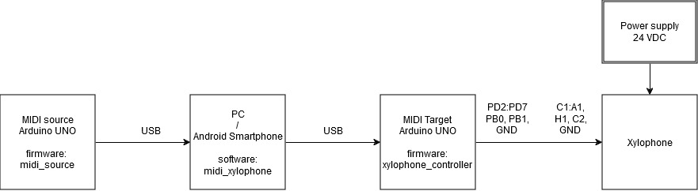
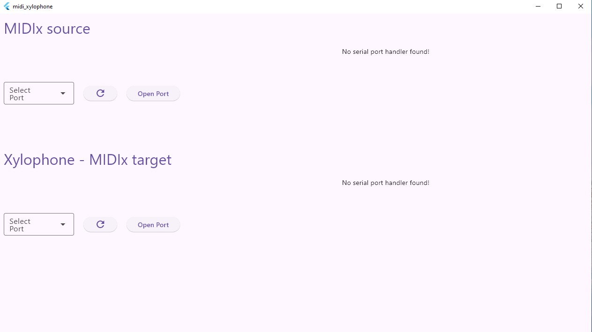
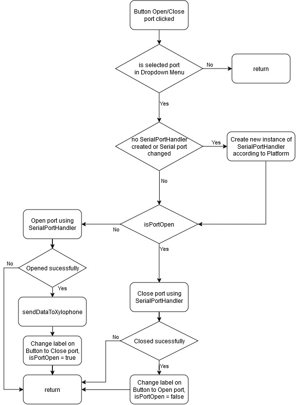
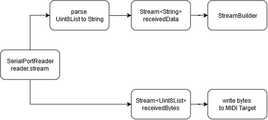
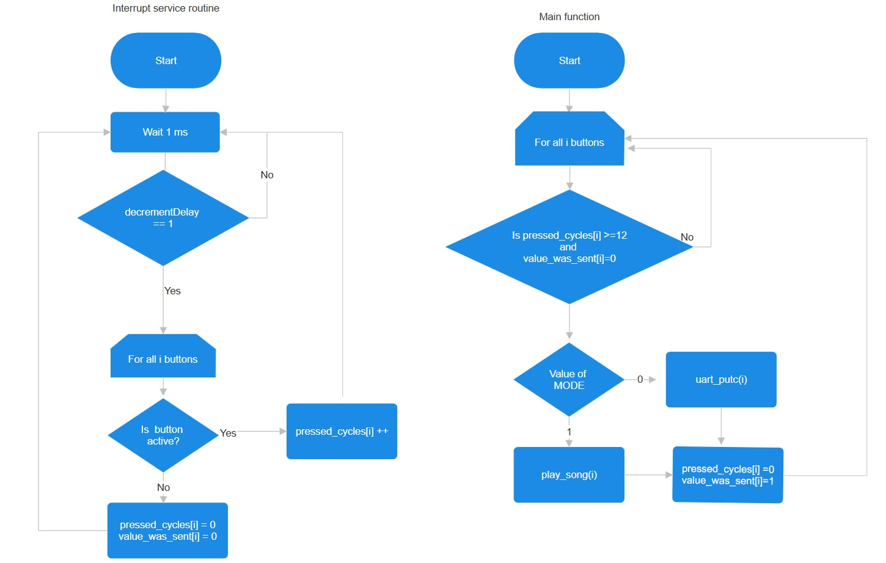
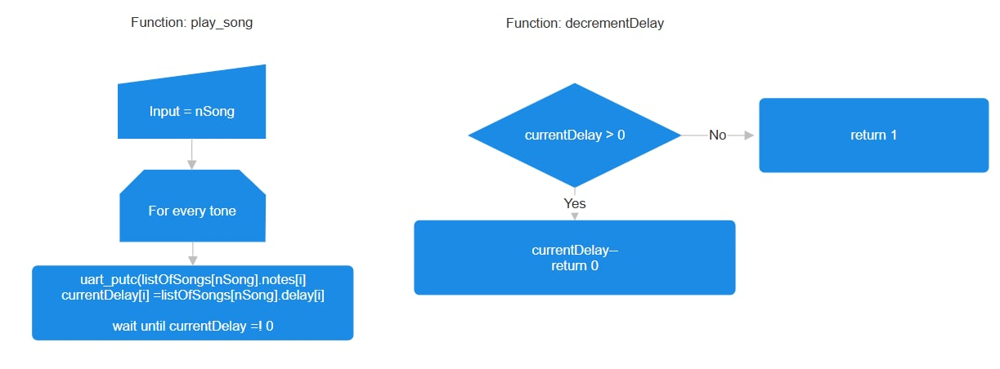

# MIDI-Xylophone

### Team members

* Josef Sikula (responsible for GUI [MIDI xylophone](midi_xylophone))
* Ondrej Vlcek (responsible for [MIDI source device](midi_source))
* Ilja Zhigachev, Mark Kovychev (responsible for [Xylophone controller](xylophone_controller))

## Hardware description
From MIDI source protocol via USB (UART) is sent to PC/Smartphone, then via USB (UART) is sent to MIDI Target, note is played on Xylophone and played note is sent back via USB to PC/Smartphone.

## Software description

### Protocol
In this project is used simpified MIDI protocol, size decresed from 3 bytes to 1 byte, only note is sent as note ON event.
Values of notes changed to range, which allows controlling xylophone using serial monitor (for example in PlatformIO) and numeric keyboard.

| **ASCII** | **Decimal** | **Note** |
| :-- | :-- | :-- |
| '0' | 48 | C&#x2081; |
| '1' | 49 | D&#x2081; |
| '2' | 50 | E&#x2081; |
| '3' | 51 | F&#x2081; |
| '4' | 52 | G&#x2081; |
| '5' | 53 | A&#x2081; |
| '6' | 54 | H&#x2081; |
| '7' | 55 | C&#x2082; |

Include flowcharts/state diagrams of your algorithm(s) and direct links to the source files in PlatformIO `src` or `lib` folders. Present the libraries you used in the project.

### MIDI Target

### GUI
[Documentation](https://raw.githack.com/j-sikula/MIDI-Xylophone/refs/heads/main/midi_xylophone/doc/api/index.html)

It is an application developed using Flutter, implements [`flutter_libserialport`](https://pub.dev/packages/flutter_libserialport) (Windows application) and [`usb_serial`](https://pub.dev/packages/usb_serial) (Android application) for connecting MIDI source and MIDI target using UART via USB.

Visualizes data from MIDI Source, sends them to MIDI Target and processed data are sent back and visualized as well.

Widgets for selecting serial ports are declared in [`serial_port_selector.dart`](midi_xylophone/lib/serial_port_selector.dart). Refresh button is used for updating available ports.

Logic of callback function Open/Close Port:

[`serial_port_handler.dart`](midi_xylophone/lib/control/serial_port_handler.dart) is used for managing logic behind serial port on Windows application, openPort, closePort are asyc, because child [`serial_port_handler_android.dart`](midi_xylophone/lib/control/serial_port_handler_android.dart) uses async function for opening and closing port.

[`note_displayer.dart`](midi_xylophone/lib/note_displayer.dart) uses stream from [`serial_port_handler.dart`](midi_xylophone/lib/control/serial_port_handler.dart) and notes are decoded and diplayed using StreamBuilder, when note is not decoded, raw data are shown in ASCII.

Structure of used Streams:

### MIDI Source
[Documentation](https://raw.githack.com/j-sikula/MIDI-Xylophone/refs/heads/main/midi_source/documentation/html/group__memory__song.html)

Goal of this part is to debounce buttons and when button is pressed, play tone or play melody from memory based of the position of the „Mode“ switch (digital input). 
There are 4 funcitons implemented:

1. [ISR](midi_source/src/main.c)

This funcion is executed every 1 ms. If decrementDelay is equal to 1 (needed only for playing melodies, not for single tones), every button is checked and when is pressed, variable pressed_cycles[i] is decrement, where i means index of button. When button is not pressed, variables pressed_cycles[i] and value_was_sent[i] are reseted.

2. [main](midi_source/src/main.c)

This function is placed in forever loop. Whenever is variable pressed_cycles[i] larger than 12 and value was not yet sent to UART (value_was_sent=0), program checks position of MODE switch and based on his position either send number of pressed button to UART for playing tone or call function play_song(i), where i is number of pressed button. In any case set pressed_cycles[i]=0 and set value_was_sent[i]=1.

3. [play_song](midi_source/lib/memory_song/memory_song.c)

Input of this function is nSong - index of pressed button. Every tone in chosen song (nSong) is read from listOfSongs[nSong] with delay after tone. In variable currentDelay is loaded delay of tone and variable is decremented by function decrementDelay. When currentDelay =1, next tone is played.

4. [decrementDelay](midi_source/lib/memory_song/memory_song.c)

This function is called from [ISR](midi_source/src/main.c) function. Everytime, when currentDelay>0, this function decrement variable currentDelay and return value 0. Variable currentDelay is decremented, until is equal to 0, afterwards returns 1 and next tone can be played.

Used libraries:
- [GPIO](https://github.com/tomas-fryza/avr-course/blob/master/solutions/lab2-gpio/lib/gpio/gpio.c) by Tomas Fryza used for GPIO control
- [UART](http://www.peterfleury.epizy.com/doxygen/avr-gcc-libraries/group__pfleury__uart.html) by Peter Fleury used for UART communication

## Instructions and photos

Describe how to use the application. Add photos or videos of your application.
[Video link](https://youtu.be/Qzyhogsb7iQ?si=1Z-Hl84LYfKJFDZ6)

## References and tools

1. [AVR course GitHub](https://github.com/tomas-fryza/avr-course)
2. [GitHub Copilot for VS Code](https://code.visualstudio.com/docs/copilot/overview)
3. [Visual Studio Code](https://code.visualstudio.com/)
4. [PlatformIO Extension for VS Code](https://platformio.org/)
5. [Flutter](https://docs.flutter.dev/get-started/install/windows/desktop)
6. [Android Studio Hedgehog](https://developer.android.com/studio/releases/past-releases/as-hedgehog-release-notes)
7. [Visual Studio Community 2022](https://visualstudio.microsoft.com/vs/community/)
8. [MIDI tutorial](https://learn.sparkfun.com/tutorials/midi-tutorial/all)
9. [app.diagrams](https://app.diagrams.net/)

